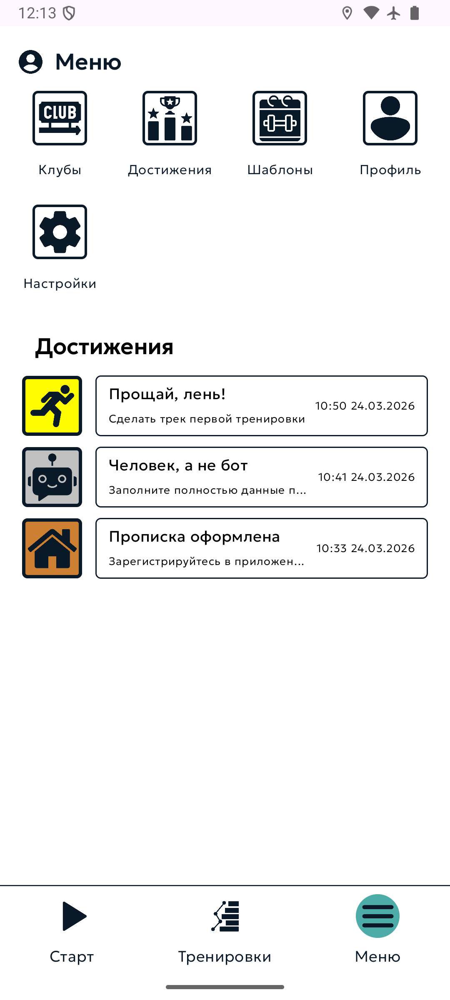
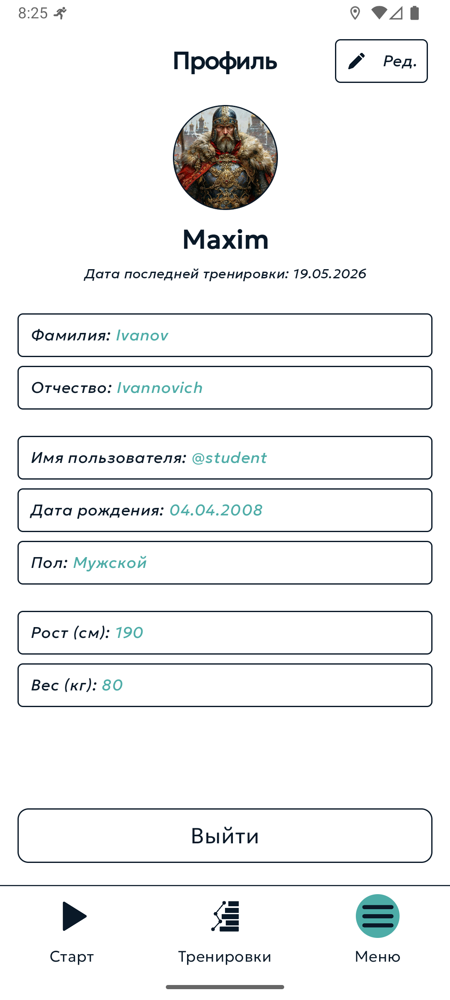
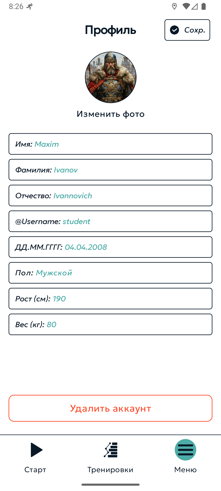
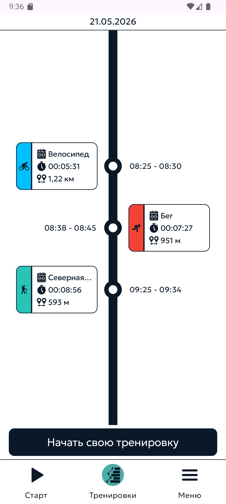

# SmartTracker — Android-клиент

Мобильное приложение для записи, трекинга и анализа спортивных тренировок. Дипломный проект (ПетрГУ), командная разработка — этот репозиторий содержит Android-клиент.

Стек: **Kotlin · Jetpack Compose · Clean Architecture · Coroutines · Hilt**

---

## Скриншоты

<table>
  <tr>
    <td align="center"><b>Запуск тренировки</b></td>
    <td align="center"><b>Сводка</b></td>
    <td align="center"><b>История</b></td>
    <td align="center"><b>Вход</b></td>
  </tr>
  <tr>
    <td></td>
    <td></td>
    <td></td>
    <td></td>
  </tr>
  <tr>
    <td align="center"><b>Меню</b></td>
    <td align="center"><b>Профиль</b></td>
    <td align="center"><b>Редактирование профиля</b></td>
    <td align="center"><b>Календарь (день)</b></td>
  </tr>
  <tr>
    <td></td>
    <td></td>
    <td></td>
    <td></td>
  </tr>
</table>

---

## Возможности

- Запись тренировки с GPS-трекингом маршрута в реальном времени
- Продолжение записи в фоне (свёрнутое приложение, заблокированный экран)
- Работа без интернета: точки копятся локально и синхронизируются при появлении сети
- История тренировок с разбивкой по дням, неделям и месяцам
- Сводка тренировки: дистанция, время, расчёт калорий по MET
- Отображение маршрута на карте
- Авторизация и регистрация, профиль пользователя

---

## Технологии

| Область | Решение |
|---|---|
| Язык | Kotlin 1.9 |
| UI | Jetpack Compose, Material 3, Navigation Compose |
| Архитектура | Clean Architecture (data / domain / presentation), MVVM |
| DI | Hilt |
| Асинхронность | Kotlin Coroutines |
| Локальная БД | Room |
| Сеть | Retrofit + OkHttp |
| Фоновые задачи | WorkManager |
| Карты | MapLibre (OpenFreeMap, без API-ключа) |
| Хранение | DataStore (настройки), Security Crypto (JWT-токены) |
| Тесты | JUnit, Mockito, MockWebServer, Robolectric |

`minSdk 26 · targetSdk 35 · compileSdk 35`

---

## Архитектурные решения

### Мультиплатформенный GPS-трекинг (GMS / HMS / AOSP)

Один APK работает на трёх типах устройств: с сервисами Google (GMS), на Huawei без Google (HMS) и на чистом AOSP. Реализовано через общий интерфейс `LocationTracker` и три реализации, которые выбираются в рантайме:

- `GmsLocationTracker` — Google FusedLocationProviderClient
- `HmsLocationTracker` — Huawei Location Kit
- `AospLocationTracker` — стандартный `LocationManager` (fallback)

`RuntimeDetector` определяет доступную среду при запуске. Обе SDK (GMS и HMS) собраны в одном APK; если одна из них отсутствует на устройстве, загрузчик классов бросает `NoClassDefFoundError`, который перехватывается — и приложение использует доступный провайдер.

### Фоновый трекинг

Запись маршрута продолжается при свёрнутом приложении через Foreground Service с `foregroundServiceType="location"`. `START_STICKY` обеспечивает перезапуск сервиса после уничтожения процесса системой, буфер точек сбрасывается в БД пакетами — данные не теряются при перезапуске.

### Offline-first

GPS-точки и завершённые тренировки сохраняются локально в Room. Отложенная синхронизация с бэкендом выполняется через WorkManager (`SyncGpsPointsWorker`, `SaveTrainingWorker`) при восстановлении сети.

---

## Структура проекта

```
app/src/main/java/com/example/smarttracker/
├── data/
│   ├── local/db/        # Room: entities, DAO, мапперы
│   ├── location/        # GPS: трекеры (GMS/HMS/AOSP), RuntimeDetector, Foreground Service
│   ├── remote/          # Retrofit API, DTO
│   ├── repository/      # реализации репозиториев
│   └── work/            # WorkManager-воркеры синхронизации
├── domain/
│   ├── model/           # доменные модели
│   ├── repository/      # интерфейсы репозиториев
│   └── usecase/         # бизнес-логика (статистика, калории, авторизация)
└── presentation/
    ├── auth/            # вход, регистрация, восстановление пароля
    ├── calendar/        # история тренировок (день/неделя/месяц)
    ├── workout/         # запуск, карта, сводка тренировки
    ├── menu/            # меню, профиль
    ├── navigation/      # Navigation Compose
    ├── common/          # переиспользуемые компоненты
    └── theme/           # тема и типографика
```

---

## Сборка

```bash
git clone https://github.com/smart-tracker/mobile-android.git
```

Открыть проект в Android Studio, дождаться синхронизации Gradle и запустить на устройстве или эмуляторе (Android 8.0+).

Базовый URL бэкенда задаётся в `app/build.gradle.kts` (`BASE_URL`).

---

## Тестирование

```bash
./gradlew test
```

Unit-тестами покрыты use-case'ы, репозитории, ViewModel'и, DTO и WorkManager-воркеры. Для тестов с Android-окружением используется Robolectric, для сетевого слоя — MockWebServer.
